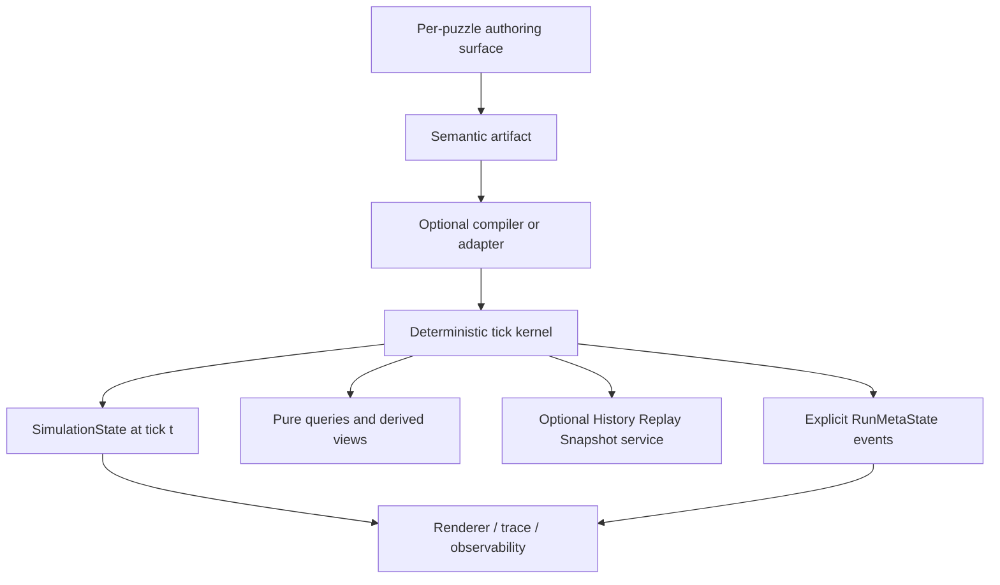

# MINIMAL_FRAMEWORK_RECOMMENDATION.md — Provisional Post-Review Position

## Status

This document is a design direction, not an implementation-ready framework contract. The review exposed load-bearing topology, progression, arbitration, query, and history questions that must be answered by a focused Round 3 probe.

## Working thesis

Use a deterministic fixed-step simulation with frozen prior-state proposals, explicit selection/arbitration, deterministic commit, and a strict presentation boundary. Keep player-facing authoring forms heterogeneous until evidence shows that a shared representation helps rather than erases meaning.

The shared kernel hypothesis is therefore:

```text
Authoring Surface
  → puzzle-specific semantic artifact
  → optional compiler / adapter
  → deterministic simulation kernel
  → queries / renderer / observability
```

Possible artifacts include `ActionPlan`, `RuleSet`, `TopologySpec`, `ConnectionMap`, `TransformChain`, and `WorldLaw`. `Directive` remains a useful optional target for action plans and rule sets; it is not a required target for every artifact.

## Layer breakdown



- **Authoring surface:** stays per-puzzle. Dragging a moss topology, selecting a connection map, ordering flowers, and typing a command plan need not look alike.
- **Semantic artifact:** preserves the player's actual decision. Do not wrap every artifact in `{op,args}` only to claim a common IR.
- **Compiler/adapter:** optional and typed. Share validation, clocks, proposal contracts, and diagnostics where useful; share syntax only where the player experience benefits.
- **Kernel:** owns time, proposal evaluation, selection, conflict handling, commit, and state boundaries.
- **History service:** optional. A puzzle may request replay, snapshots, rule-versioning, or trace collection without making those capabilities part of every world model.
- **Run metadata:** achievements, unlocks, and run identity are separate from historical simulation facts.

## Conceptual contracts

The following are deliberately labeled conceptual sketches. They describe boundaries to probe; they are not drop-in TypeScript APIs.

### Simulation state and run metadata

```ts
type SimulationState = {
  tick: number
  values: Record<string, unknown>
  structures: Record<string, unknown>
}

type RunMetaState = {
  runId: string
  achievements: Record<string, boolean>
  unlocks: Record<string, boolean>
  events: Array<{ tick: number; kind: string; data: unknown }>
}
```

`SimulationState(t)` is the historical truth shown when the player inspects tick `t`. A scrub must not alter it. `RunMetaState` persists across scrubbing only because an explicit run event updated it; it must not silently rewrite a historical simulation frame. A meta event may read a declared simulation result, but it cannot mutate simulation state outside the tick/effect contract.

### Optional Directive lists

```ts
type Directive = {
  op: string
  args: Record<string, number | string | boolean>
}

type SequencePolicy = {
  advance: 'always' | 'on-success' | 'until-success'
  termination: 'once' | 'loop' | 'repeat-n' | 'hold'
}

type ScanPolicy = {
  selection: 'first-match' | 'all-match' | 'priority' | 'exclusive'
  conflict: 'reject' | 'merge' | 'declared-order'
}
```

These policy fields are required whenever a puzzle chooses a sequence or scan representation:

- failed actions may consume a tick without advancing;
- `on-success` and `until-success` must define retry and livelock behavior;
- finite programs must not wrap unless `loop` or `repeat-n` is declared;
- first-match, all-match, priority, and exclusive groups are distinct;
- simultaneous writes need an explicit conflict policy rather than accidental patch-order selection.

### Proposal and tick discipline

```ts
type Proposal = {
  source: string
  outcome: 'success' | 'failure'
  consumesTick: boolean
  effects: Array<{ target: string; value: unknown }>
  reason?: string
}

// Conceptual sketch: collect, evaluate, arbitrate, commit, then query.
function tick(
  prior: SimulationState,
  meta: RunMetaState,
  intents: unknown[],
  queries: Record<string, (state: SimulationState) => unknown>
): {
  state: SimulationState
  meta: RunMetaState
  views: Record<string, unknown>
  proposals: Proposal[]
} {
  const proposals = collectAndEvaluate(intents, prior)
  const accepted = arbitrate(proposals, prior)
  const state = commit(prior, accepted)
  const views = Object.fromEntries(
    Object.entries(queries).map(([name, query]) => [name, query(state)])
  )
  const metaEvents = deriveExplicitMetaEvents(state, accepted)
  return { state, meta: applyMetaEvents(meta, metaEvents), views, proposals }
}
```

The helper names in this sketch are conceptual boundaries, not hidden global functions. Their contracts must be specified before implementation. In particular, `arbitrate` must select first/all/priority/exclusive matches and resolve effect conflicts deterministically; `commit` must read no in-flight result while proposals are being evaluated.

## Structure/Topology gate

The recommendation cannot exclude runtime structure semantics:

- Mimic Moss executes synchronous neighbor propagation with distance and color transformation (`experiments/cross-model-deepseek/demo-06/index.html:87-105,130-139`).
- Programming Spider creates persistent edges that later carry rain (`experiments/blind-batch-001/demo-07/index.html:4`; `DESIGN.md:9-23`).
- Circuit Golem changes connection mapping from eyes to arms (`experiments/cross-model-claude-sonnet-5/demo-06/index.html:71-85,122-169`).
- Prism Burrow composes an ordered chain of transformations (`experiments/cross-model-kimi-k3/demo-06/index.html:98-102,176-182`).

Do not build a general graph-rewriting engine yet. First test the smallest typed capability that can support the four cases. It may become one Structure service, several domain types, or ordinary state plus puzzle-specific queries. The framework must not decide that question by assuming every structure is a Directive list.

## History and replay gate

History/Replay/Snapshot is an optional engine service. DeepSeek's pure `SIM.run` shows that replay can be valuable (`experiments/cross-model-deepseek/demo-05/index.html:76-104`), but forward-only puzzles may prefer incremental state. If a puzzle allows hot-editing during a replayable run, authored rules must be versioned by tick; a replay query must never read a live rule set and silently rewrite earlier history.

Snapshots are an optimization and a semantic boundary only when a puzzle exposes scrubbing. They do not turn achievements into historical simulation cells.

## Probe plan before implementation

### Probe 1 — Echo Chamber progression

Represent a failed `PRESS` that consumes a tick but leaves the cursor/action position unchanged (`experiments/cross-model-claude-sonnet-5/demo-03/index.html:68-72`). Run the same scenario with `always`, `on-success`, `once`, and `loop` policies. Acceptance: no policy is smuggled in through `ok` or modulo arithmetic.

### Probe 2 — Dam scan arbitration

Use thresholds where multiple rules match, then compare `first-match`, `all-match`, `priority`, and `exclusive` policies (`experiments/cross-model-deepseek/demo-05/index.html:76-90`). Acceptance: no patch is selected by incidental iteration order; conflict behavior is visible in the result.

### Probe 3 — Mimic Moss and Programming Spider structure

Run Moss with multiple paths, equal-distance colors, cycles, and sprouting; run Spider with duplicate, broken, and disconnected edges. Acceptance: determine whether a shared structure API is real or whether typed topology and relation artifacts should remain separate.

### Probe 4 — Golem mapping and Prism chain

Compare a connection map and an ordered transformation chain against the structure API from Probe 3. Acceptance: reject an abstraction that makes either authored artifact less legible or semantically ambiguous.

### Probe 5 — History versus metadata

Scrub a historical gate before its opening while preserving a separately recorded achievement. Acceptance: the selected `SimulationState(t)` is truthful, and `RunMetaState` persists only through explicit event semantics.

## Explicit non-goals for this gate

- No ECS commitment: the corpus does not require entity-component-system machinery.
- No universal drag-and-drop or node-editor UI in the kernel.
- No arbitrary player-authored JavaScript evaluation.
- No assumption that all programs are instruction lists.
- No general graph-rewriting engine before the structure probes justify one.
- No general FRP/dataflow engine before Query versus derived-state probes justify dependency semantics.

## Open risks and decisions

1. **Structure boundary:** one reusable structure service versus typed domain structures.
2. **Authoring adapters:** shared validation and diagnostics versus a shared compiler target.
3. **Progression:** exact retry, time-consumption, termination, and livelock semantics.
4. **Arbitration:** selection, priority, equal-priority ties, and write conflicts.
5. **Query model:** pure views, identity-bearing derived state, or both.
6. **History service:** snapshots, rule versions, trace policy, and performance at long timelines.
7. **Simulation/meta split:** which events award achievements and which facts remain historical.

## Implementation gate

Do not begin framework probes in production code until the Round 3 matrix has evidence-backed decisions for topology/structure, the role of `Directive`, History/Replay/Snapshot, Query versus derived state, progression, scan arbitration, and the SimulationState/RunMetaState boundary. The only recommendation ready to carry forward now is the deterministic fixed-step causal discipline and the separation between simulation and presentation.

## Validation note

This revision is documentation-only, so no automated implementation tests are required. Validate it with a manual evidence audit, grep for stale claims, repository-qualified path checks, cross-document terminology checks, and a pseudo-API sanity pass. Every code block in this document is labeled conceptual and must remain internally coherent.
