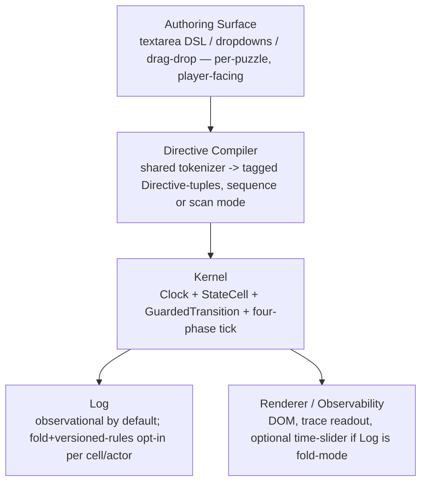

# MINIMAL_FRAMEWORK_RECOMMENDATION.md

## One-Sentence Thesis

> A world is a small set of named cells mutated only through guarded, four-phase-disciplined transitions fired by one or more instruction lists sharing a clock — direct mutation is the default causal engine, and any puzzle may opt a specific cell or actor into authoritative, versioned replay-logging when (and only when) it actually needs free time-travel.

This is the **minimal architectural commitment** answer: one behavioral atom (`GuardedTransition`), one data atom (`StateCell`), one program atom (`Directive`), a shared `Clock`, and a `Log` whose *authority* is a per-puzzle dial, not a framework-wide constant.

---

## Chosen Architecture — a Justified Synthesis, Not a Single Candidate

Per `FRAMEWORK_ADVERSARIAL_REVIEW.md`'s final scorecard, no candidate from `FRAMEWORK_CANDIDATES.md` wins outright. The recommendation is a deliberate merge, traceable line-by-line to the debate:

1. **Default kernel discipline = Candidate 1 (Tape Machine).** Direct mutation, `Directive(sequence)` as the player's primary mental model ("a numbered list of steps"), because Section 1 and Combo 3 both show this is the only option that is *safe by default* against mid-run player-code interruption — the single explicitly-named nasty case in this round's brief.
2. **Every tick, regardless of authority mode, runs Candidate 2's discipline internally** — the Section 2 four-phase law (collect → propose against frozen prior-state → commit in fixed order → recompute one-level derived cells). This is not optional ceremony; Combo 1 and the state-pollution attack both show hand-ordered convention (what Echo Chamber Bridge does today, by luck) is not good enough for a shared kernel meant to host puzzles no single author has reviewed together.
3. **Fold-authority (Candidate 2's free scrubbing) is available per-puzzle, per-cell, opt-in** — not the default, because Combo 3 proves naive always-on replay-from-log is unsafe under hot-editing unless the extra rule-versioning discipline (below) is also paid for. Puzzles that want an Echo-Canyon-style time slider request it explicitly and get the versioning machinery that makes it safe.
4. **Candidate 3's derived-cell mechanism is retained as a first-class, always-available capability** (`StateCell(derived)`) — not a competing kernel, just the correct treatment for wiring/law/ecology content, exactly as Section 3's `LawCell` collapse demonstrated.
5. **Two additions earned by the red-team, not present in Round-1 thinking**, are now mandatory parts of the spec: (a) `StateCell.scope: 'per-tick' | 'run'` (Combo 2 — latches must not flicker under scrubbing), and (b) rule/program changes are themselves logged, versioned events, never an ambient live global a replay function reads (Combo 3).

---

## Layer Breakdown



- **Authoring Surface:** per-puzzle (text DSL, dropdowns, drag targets) — deliberately *not* unified, because puzzle content should not be forced into one visual language (`coding-game 4D Product Description.md` explicitly keeps the visual form open). What *is* shared is layer B.
- **Directive Compiler:** the one piece of infrastructure the current 40-demo corpus lacks and should gain — a shared tokenizer that any puzzle's authoring surface targets, emitting `Directive{op,args,mode}`. This directly answers Section 1's open dissent (Beta): unifying the kernel IR is necessary but not sufficient without also unifying the compiler surface puzzles emit into.
- **Kernel:** the only layer this document specifies in detail (below). Puzzle-agnostic, ships once.
- **Log:** per-puzzle dial. Default `observational`. A puzzle (or a single actor/cell within a puzzle) may declare `fold` + a snapshot interval + rule-versioning, at the cost of the bookkeeping in Combo 3's patch.

---

## Core API / Data Structure Contracts

```ts
type Clock = number

type StateCell<T = unknown> =
  | { kind: 'stored';  scope: 'per-tick' | 'run'; value: T }
  | { kind: 'derived'; formula: (clock: Clock, stored: Readonly<Record<string, unknown>>) => T }
  // 'run'-scoped stored cells are write-once-per-run latches (Combo 2): a fold-replay
  // to any tick T never un-sets a 'run'-scoped cell that was true at the *live* tick,
  // even while inspecting T < the tick it first became true.

type Directive = { op: string; args: Record<string, number | string | boolean> }

type DirectiveList = {
  id: string
  mode: 'sequence' | 'scan'
  items: Directive[]
  pc?: number                 // sequence mode only
}

type Firing = { listId: string; directive: Directive; tick: Clock }

type TraceEntry = { tick: Clock; source: string; op: string; ok: boolean; reason?: string }

type GuardedTransition = (
  cells: Readonly<Record<string, StateCell>>,
  firing: Firing
) => { ok: true; patch: Record<string, StateCell> } | { ok: false; reason: string }

type World = {
  cells: Record<string, StateCell>
  lists: DirectiveList[]
  log:
    | { authority: 'observational'; entries: TraceEntry[] }
    | { authority: 'fold'; ruleVersions: Array<{ sinceTick: Clock; lists: DirectiveList[] }>
      ; snapshotEveryTicks: number; snapshots: Array<{ tick: Clock; cells: Record<string, StateCell> }> }
}

// The one required kernel function, mandatory four-phase discipline (Section 2 verdict):
function tick(world: World, t: Clock, transitions: Record<string, GuardedTransition>): World {
  // Phase A — collect, from the ruleset active AT TICK t (fold mode) or live (observational mode)
  const activeLists = world.log.authority === 'fold'
    ? mostRecentRuleVersionAtOrBefore(world.log.ruleVersions, t)
    : world.lists
  const firings: Firing[] = activeLists.flatMap(l =>
    l.mode === 'sequence'
      ? (l.pc! < l.items.length ? [{ listId: l.id, directive: l.items[l.pc!], tick: t }] : [])
      : l.items.map(d => ({ listId: l.id, directive: d, tick: t })))

  // Phase B — propose, reading ONLY world.cells as committed before this tick (never another firing's result)
  const proposals = firings.map(f => ({ f, r: transitions[f.f?.directive.op ?? f.directive.op](world.cells, f) }))

  // Phase C — commit, in fixed firing order
  let cells = { ...world.cells }
  const trace: TraceEntry[] = []
  for (const { f, r } of proposals) {
    if (r.ok) cells = { ...cells, ...r.patch }
    trace.push({ tick: t, source: f.listId, op: f.directive.op, ok: r.ok, reason: r.ok ? undefined : r.reason })
  }

  // Phase D — recompute derived cells, one level only, from cells just committed
  for (const [k, c] of Object.entries(cells)) if (c.kind === 'derived') cells[k] = { ...c, }; // formula evaluated lazily on read

  // Phase E — advance sequence-mode program counters for firings that succeeded
  const lists = activeLists.map(l => {
    if (l.mode !== 'sequence') return l
    const fired = proposals.find(p => p.f.listId === l.id)
    return fired?.r.ok ? { ...l, pc: (l.pc! + 1) % l.items.length } : l
  })

  return { ...world, cells, lists, log: appendTrace(world.log, trace) }
}

// Free-when-opted-in scrubbing (Candidate 2, per Section 2 + Combo 3 patch):
function stateAt(world: World, targetTick: Clock, transitions: Record<string, GuardedTransition>): World {
  if (world.log.authority !== 'fold') throw new Error('scrubbing requires fold authority')
  const base = nearestSnapshotAtOrBefore(world.log.snapshots, targetTick) // bounds cost to O(snapshotEveryTicks)
  let w = base
  for (let t = base_tick + 1; t <= targetTick; t++) w = tick(w, t, transitions)
  return w
}
```

Everything above is a direct, line-traceable implementation of the 5 primitives in `PRIMITIVE_COMPOSITION.md` — nothing new is introduced except the two red-team-earned flags (`StateCell.scope`, `log.ruleVersions`).

---

## Three Heterogeneous Probe Validations

### Probe 1 — Echo Chamber Bridge (multi-actor, simultaneous gate)
```
lists = [
  {id:'echo', mode:'sequence', items:[MOVE,MOVE,MOVE,PRESS], pc:0},
  {id:'live', mode:'sequence', items:[MOVE,MOVE,MOVE,MOVE,MOVE,PRESS], pc:0}
]
cells = { echoPos: stored(0), livePos: stored(0), gateOpened: stored(false, scope:'run') }
transition('PRESS') = (cells, firing) =>
  firing.listId==='echo'
    ? (cells.echoPos.value===PLATE_A ? {ok:true, patch:{}} : {ok:false, reason:'not on plate'})
    : (cells.livePos.value===PLATE_B ? {ok:true, patch:{}} : {ok:false, reason:'not on plate'})
derived('gateReady') = (clock, s) => /* Phase D, reads Phase-C-committed echoPos/livePos */
  wasFiredOkThisTick('echo','PRESS') && wasFiredOkThisTick('live','PRESS')
// Phase E then sets gateOpened.value = true (scope:'run') the first tick gateReady is true — survives any later scrub.
```
Both lanes fire in Phase B against the **same frozen prior tick**; the joint condition is a Phase-D derived read. No kernel change from the generic spec above. Confirms Combo 1's verdict.

### Probe 2 — Mole Sensor Greenhouse (scan-mode, sensor-alias, continuous ODE)
```
cells = { s1_target: stored(2), s2_target: stored(1), 'pot0.m': stored(30), ..., 'pot3.m': stored(30) }
lists = [{id:'rules', mode:'scan', items:[
  {op:'water_if', args:{sensorCell:'s1_target', thr:50, potIdx:0}},
  {op:'water_at', args:{t:6, potIdx:2, dur:4}}
]}]
transition('water_if') = (cells, f) => {
  const sensedPot = cells[f.directive.args.sensorCell].value            // the alias dereference, Section 3.1's de-sugar
  const moisture = cells[`pot${sensedPot}.m`].value
  return moisture < f.directive.args.thr
    ? { ok:true, patch: { [`pot${f.directive.args.potIdx}.watering`]: stored(true) } }
    : { ok:false, reason:'above threshold' }
}
```
`scan` mode re-fires every item every tick (no `pc`); the alias indirection (`s1_target` naming which pot) is an ordinary `StateCell` dereference inside the transition, exactly as `PRIMITIVE_EXTRACTION.md` §3.1 concluded. The ODE-like moisture decay is a second, unconditional (`always-ok`) transition firing every tick — no new primitive.

### Probe 3 — Dam That Breathes (continuous law + one-way latch + fold-authority scrubbing, opted in)
```
world.log = { authority:'fold', ruleVersions:[{sinceTick:0, lists:[cascadeRules]}], snapshotEveryTicks: 25, snapshots:[] }
cells = { level: stored(48), opening: derived((clock,s)=> firstMatch(s.cascadeRules, s.level).open), gate: stored(false, scope:'run') }
transition('advance_river') = always-ok; patch = { level: level + (inflow(clock) - outflow(level,opening))/AREA }
```
Player edits the rule cascade mid-run → recorded as a **new entry in `ruleVersions` at the live tick**, never mutating the version already used for ticks before it. `stateAt(world, T)` for any `T` replays only from the nearest snapshot, using whichever `ruleVersions` entry was active at each historical tick — directly resolving Combo 3. `gate`'s `scope:'run'` ensures scrubbing to `T` before the latch tick shows the true historical `opening`/`level` without retracting the achievement — directly resolving Combo 2.

All three probes run on the **same unmodified kernel** (`tick`/`stateAt` above) with zero puzzle-specific kernel forks — the composability claim from `PRIMITIVE_COMPOSITION.md` holds under adversarial load.

---

## Explicit Non-Goals (Tier C — do not build)

- A general reactive/FRP engine with multi-level derived-cell dependency graphs, cycle detection, or topological re-evaluation — killed twice (Round 1 Paradigm C weakness; this round's `LawCell` collapse). The one-level derivation rule is deliberately load-bearing and must not be "improved" into a general dataflow graph.
- A general graph-rewriting/term-rewriting engine for "wiring" puzzles — Section 1 and `PRIMITIVE_EXTRACTION.md` §3.3 found zero runtime graph traversal in any shipped demo; every "wiring" instance is a flat expression scan.
- A general `Relation(EntityA, EntityB, kind)` triple-store for inventory/carrying — no demo ever performs a reverse relational query; a namespaced `StateCell` always sufficed.
- `eval()`/`new Function()` of arbitrary player-authored JS — zero precedent in 40 demos; every "program" is a restricted tagged-tuple stream through a bespoke tokenizer. Any real language growth happens at the Directive Compiler layer, not by widening to a general-purpose language.
- Self-modifying / program-as-freely-mutable-world-entity (full Paradigm C) — one narrow precedent (Replay Printshop) is fully covered by "a cell may hold Directive data"; nothing more should be built.
- A universal drag-and-drop / node-editor authoring UI baked into the kernel — authoring surfaces stay per-puzzle (Layer Breakdown, layer A); only the compiler target (layer B) is shared.

---

## Open Risks & Honest Limitations

1. **O(T)/O(T²) replay cost for fold-authority puzzles without snapshotting is a real scaling cliff**, currently masked because every demo in the corpus keeps `maxT` in the low hundreds. `snapshotEveryTicks` is not optional once a puzzle's timeline is meant to run long or continuously.
2. **Rule-versioning (Combo 3's patch) adds real authoring/engine complexity** that puzzles using plain `observational` authority never have to pay. This is a genuine cost of offering free scrubbing, not a solved-for-nothing win — pick `fold` per-puzzle deliberately, not by default.
3. **The `scope:'run'` vs per-tick distinction on `StateCell` (Combo 2) is new, untested in any shipped demo.** It is derived logically from the debate, not empirically observed — flag it to a human designer before relying on it for a real "scrub back in time" player-facing feature.
4. **The Directive Compiler (shared tokenizer/authoring layer) does not exist yet anywhere in the corpus.** Every one of the 40 demos hand-rolls its own parser. This recommendation's kernel layer is fully evidenced; its compiler layer is a design proposal, not yet an empirical finding, and is the largest remaining piece of net-new engineering implied by this document.
5. **Beta's open dissent from Section 1 stands:** unifying the kernel IR does not by itself unify the player-visible language. "The language grows with the player" (product principle) requires the Directive Compiler to actually be shared across puzzles going forward — a process/adoption discipline this document cannot enforce by architecture alone.
